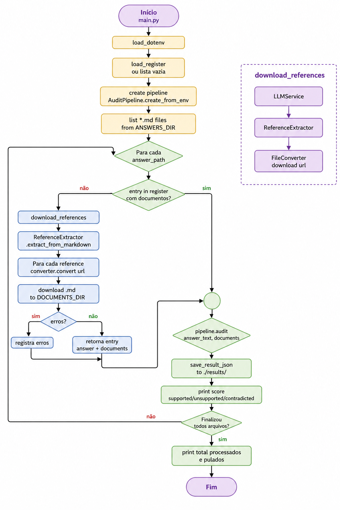
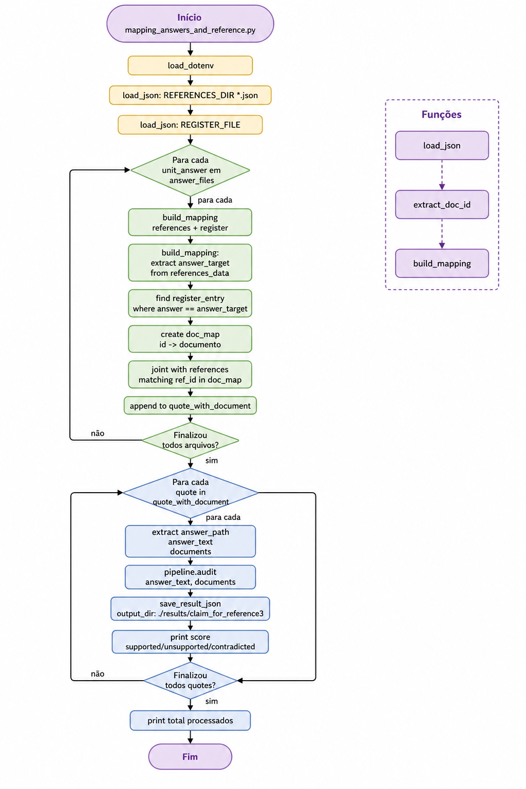

# AuditorFidelidade

Sistema de auditoria factual que avalia a veracidade de afirmações em um texto, utilizando LLMs e embeddings vetoriais.

## Características

- **Extração de Afirmações**: Usa LLM para extrair afirmações factuais atômicas de um texto
- **Busca por Evidências**: Recupera passagens relevantes usando FAISS + similaridade de cosseno
- **Verificação**: Classifica afirmações como `SUPPORTED`, `UNSUPPORTED` ou `CONTRADICTED`
- **Pontuação**: Calcula score de 0 a 1 baseado nas verificações
- **Embeddings Locais**: Usa `sentence-transformers/all-MiniLM-L6-v2` via HuggingFace
- **Extração de Referências**: Extrai URLs de referências de arquivos markdown e baixa conteúdo
- **Pipeline Integrado**: Executa todo o fluxo de auditoria em um único comando
- **Resultados em JSON**: Salva resultados em arquivos JSON estruturados por answer
- **Múltiplos Providers LLM**: Suporte a OpenAI (inclui LM Studio) e Ollama
- **POO**: Código estruturado com classes e serviços separados
- **Type Hints**: Sistema fortemente tipado
- **FAISS**: Banco vetorial para persistência e busca de embeddings
- **Análise de Resultados**: Scripts para somatório e extração de claims por label

## Requisitos

- Python 3.8+
- API Key da OpenAI (para modelos OpenAI/LM Studio) - opcional para Ollama
- Ollama ou LM Studio instalados localmente (opcional)

### Dependências

```
langchain
langchain-community
langchain-core
langchain-huggingface
langchain-ollama
langchain-openai
faiss-cpu
numpy
tqdm
requests
openai
sentence-transformers
dotenv
trafilatura
pymupdf4llm
```

## Instalação

```bash
pip install -r requirements.txt
```

## Estrutura do Projeto

```
AuditorFidelidade/
├── main.py                                          # Entry point principal (fluxo integrado)
├── mapping_answers_and_reference.py                  # Script alternativo com references LLM
├── teste.py                                         # Script de análise de resultados
├── answers/                                         # Arquivos de resposta (.md)
├── documents/                                       # Documentos de referência baixados (.md)
├── register/                                        # Registro de downloads e erros
│   └── register.json
├── references/                                      # References extraídas por LLM
│   └── references_lmStudio_*.json
├── results/                                         # Resultados da auditoria
│   ├── claim_for_reference3/                        # Resultados da auditoria
│   │   └── audit_*.json
│   ├── result_supported.json                        # Claims SUPPORTED extraídas
│   └── result_unsupported.json                      # Claims UNSUPPORTED extraídas
├── diagrams/                                        # Diagramas de fluxo
│   ├── flowMainFile.png
│   └── flowMappingFile.png
├── requirements.txt
├── .env
├── .env.example
├── README.md
└── src/
    └── auditor/
        ├── __init__.py
        ├── config/
        │   └── settings.py
        ├── models/
        │   ├── claim.py
        │   └── verification_result.py
        ├── services/
        │   ├── llm_service.py
        │   ├── embedding_service.py
        │   ├── vector_store.py
        │   ├── reference_extractor.py
        │   ├── file_converter.py
        │   ├── perplexity_service.py
        │   └── openai_service.py
        ├── core/
        │   ├── claim_extractor.py
        │   ├── retriever.py
        │   ├── verifier.py
        │   └── scorer.py
        ├── pipeline/
        │   └── audit_pipeline.py
        └── utils/
            └── helpers.py
```

## Fluxo de Execução - `main.py`



## Fluxo de Execução - `mapping_answers_and_reference.py`



Este script utiliza as references extraídas previamente por LLM (arquivos em `./references/`) para executar a auditoria. Útil quando se tem um conjunto fixo de documents de referência.

### Detalhes do Fluxo

1. **Levantamento**: Lista todos os arquivos `.md` em `./answers/`

2. **Verificação**: Consulta `./register/register.json` para verificar se o answer já foi processado

3. **Download** (se necessário):
   - Extrai URLs de referências do arquivo markdown usando LLM
   - Baixa conteúdo de cada URL para `./documents/`
   - Salva os registros em `register.json` para consulta posterior

4. **Auditoria**:
   - Lê conteúdo do answer e documentos
   - Extrai claims factuais
   - Recupera passagens relevantes
   - Classifica como SUPPORTED/PARTIAL/NOT_SUPPORTED
   - Calcula score final

5. **Resultado**: Salva em `./results/AnswerName/audit_TIMESTAMP.json`

## Scripts de Análise

### teste.py - Análise de Resultados

Script para análise dos resultados da auditoria. Gera somatório e extração de claims por label.

```bash
python teste.py
```

**Funcionalidades:**
- Soma os campos `total_supported`, `total_unsupported`, `total_contradicted` de todos os arquivos JSON
- Extrai claims com label `SUPPORTED` para `result_supported.json`
- Extrai claims com label `UNSUPPORTED` para `result_unsupported.json`

---

## Uso

### Executar o fluxoo completo

```bash
python main.py
```

### Adicionar novo answer

1. Adicione o arquivo `.md` em `./answers/`

2. Execute o main.py:
```bash
python main.py
```

3. O sistema irá:
   - Detectar o novo arquivo
   - Baixar as referências
   - Executar a auditoria
   - Salvar os resultados

### Usar como módulo

```python
from src.auditor import AuditPipeline

pipeline = AuditPipeline.create_from_env()

# Com paths de arquivos
answer = "answers/minha_resposta.md"
documents = ["documents/doc1.md", "documents/doc2.md"]

result = pipeline.audit(answer, documents)

print(f"Score: {result.score}")
print(f"Supported: {result.total_supported}")
print(f"Unsupported: {result.total_unsupported}")
print(f"Contradicted: {result.total_contradicted}")
```

### Usar com texto direto

```python
from src.auditor import AuditPipeline

pipeline = AuditPipeline.create_from_env()

answer = """
Brazil was colonized by Portugal in the 16th century.
It became independent in 1822.
The capital of Brazil is Rio de Janeiro.
"""

documents = [
    "Brazil was colonized by Portugal during the 1500s. It gained independence in 1822.",
    "The capital of Brazil is Brasília, not Rio de Janeiro."
]

result = pipeline.audit(answer, documents)
```

## Registro (register.json)

O arquivo `register.json` armazena o estado do processamento:

```json
[
  {
    "answer": "answers/gemini_Factualidade_em_LLMs_Benchmark.md",
    "documents": [
      "documents/gemini_Factualidade_em_LLMs_Benchmark_doc_1.md",
      "documents/gemini_Factualidade_em_LLMs_Benchmark_doc_2.md"
    ],
    "errors": [
      {
        "url": "https://exemplo.com/erro",
        "error_type": "HTTPError",
        "error_message": "404 Not Found",
        "reference_id": 1
      }
    ]
  }
]
```

## Exemplo de Resultado

```json
{
  "timestamp": "20260421_194319",
  "score": 0.65,
  "total_supported": 4,
  "total_unsupported": 2,
  "total_contradicted": 1,
  "is_fully_supported": false,
  "claims": [
    {
      "index": 0,
      "text": "Brazil was colonized by Portugal.",
      "source_answer": "..."
    }
  ],
  "results": [
    {
      "claim_index": 0,
      "claim_text": "Brazil was colonized by Portugal.",
      "label": "SUPPORTED",
      "justification": "The evidence directly confirms Brazil was colonized by Portugal during the 1500s.",
      "passages": ["Brazil was colonized by Portugal during the 1500s."]
    }
  ]
}
```

## Cálculo do Score

O score é calculado com base nas verificações das afirmações:

```
score = suportadas / total
```

**Exemplo:**
```
10 claims
7 suportadas
2 unsupported
1 contradicted
score = 7 / 10 = 0.70
```

**Interpretação:**
- `SUPPORTED`: Afirmação validada pelas evidências (peso 1.0)
- `UNSUPPORTED`: Afirmação não sustentada pelas evidências (peso 0.0)
- `CONTRADICTED`: Afirmação contradita pelas evidências (peso 0.0)

## Configurações

### Providers LLM

| Provider | Descrição |
|----------|-----------|
| `openai` | OpenAI API, LM Studio, ou qualquer API OpenAI-compatible |
| `ollama` | Ollama local |

### Variáveis de Ambiente

| Variável | Descrição | Obrigatório |
|----------|-----------|-------------|
| `OPENAI_API_KEY` | API key da OpenAI | Sim (exceto para Ollama) |
| `LLM_PROVIDER` | Provider LLM (`openai` ou `ollama`) | Não (padrão: `openai`) |
| `LLM_BASE_URL` | URL base do LLM | Não |
| `LLM_MODEL` | Modelo LLM a usar | Não |
| `EMBEDDING_MODEL` | Modelo de embedding | Não |
| `EMBEDDING_CACHE_FOLDER` | Pasta de cache dos modelos | Não |

### Arquivo .env

```env
OPENAI_API_KEY=sua-chave-openai

# Para LM Studio
LLM_PROVIDER=openai
LLM_BASE_URL=http://localhost:1234
LLM_MODEL=google/gemma-4-e4b

# Para Ollama
LLM_PROVIDER=ollama
LLM_BASE_URL=http://localhost:11434
LLM_MODEL=gpt-oss:20b
```

### Usar LM Studio

1. Baixe e instale o LM Studio
2. Baixe o modelo desejado (ex: `google/gemma-4-e4b`)
3. Inicie o servidor na interface
4. Configure o `.env`:

```env
LLM_PROVIDER=openai
LLM_BASE_URL=http://localhost:1234
LLM_MODEL=google/gemma-4-e4b
```

### Usar Ollama

1. Instale o Ollama
2. Baixe o modelo: `ollama pull gpt-oss:20b`
3. Configure o `.env`:

```env
LLM_PROVIDER=ollama
LLM_BASE_URL=http://localhost:11434
LLM_MODEL=gpt-oss:20b
```

## API Utilizada

### Audit Pipeline
- **LLM**: Configurável via `LLM_MODEL` (padrão: `google/gemma-4-e4b`)
- **Embedding**: `sentence-transformers/all-MiniLM-L6-v2`