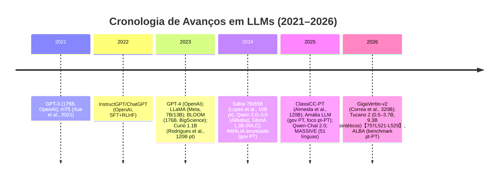

# Resumo Executivo  
Nos últimos cinco anos (2021–2026), avançaram-se significativamente os **LLMs multilíngues**, mas desafios persistem para línguas de poucos recursos como o português. A maioria dos LLMs de ponta (e.g. GPT-4, LLaMA, BLOOM, Qwen) são arquiteturas Transformer (geralmente decodificadoras) com bilhões de parâmetros【77†L67-L70】【35†L579-L584】. Em 2024–2026 surgiram modelos especializados em português: *Sabia* (7B/65B, 2024) e *Curió* (1.1B, 2023) usaram 10B e 120B tokens respectivamente【88†L181-L189】, e recentemente o *Tucano 2* (0.5–3.7B, 2026) usou 320B tokens em pt【75†L521-L529】. Instrução e RLHF tornaram-se padrão de alinhamento (ex.: InstructGPT 2022, ChatGPT 2022)【35†L579-L584】, mas esses dados de ajuste são, em grande parte, em inglês. Em termos de benchmarks, constatou-se que o português europeu é subrepresentado: avaliações multilíngues com frequência usam traduções MT (e.g. XTREME) ou corpus genéricos (Common Crawl)【87†L102-L110】【87†L113-L122】. Iniciativas como o *PORTULAN ExtraGLUE* (2024) traduziu tarefas GLUE para pt-PT/pt-BR【92†L69-L77】, e *ALBA* (2026) criou testes específicos para nuances do pt-PT【87†L102-L110】. Entre desafios técnicos destacam-se: escassez e qualidade de dados em pt (mesmo sendo a 5ª língua mais falada, dados limpos são escassos【88†L101-L109】), tokenização ineficiente para português (fertilidade de subpalavras elevada nos vocabulários multilíngues genéricos), transferência cross-línguas limitada (modelos apresentam 5× mais erros em idiomas pobres como pt que em ingles【25†L13-L20】) e custos computacionais de treinar LLMs na escala tradicional.  Os desafios éticos incluem: **viéses culturais e linguísticos** (LLMs tendem a replicar predominância do português do Brasil sobre o Europeu【87†L102-L110】), **segurança** (possível geração de conteúdo nocivo ou enviesado), **privacidade** (LLMs podem memorizar e vazar dados de treino【59†L162-L169】), **desinformação** (hallucinações em pt podem propagar fake news) e **direitos autorais** (controversas legais como o processo Folha vs OpenAI no Brasil sobre uso de conteúdo protegido【83†L100-L109】【83†L125-L134】). Para cada desafio, há iniciativas: filtragem via classificadores de qualidade (e.g. Edu/Toxic classifiers em GigaVerbo-v2【75†L521-L529】), geracão sintética de dados, adaptação de tokenizadores (unigram/BPE dedicados, como o SentencePiece de 49K vocabulários que alcançou compressão de 2.88 chars/token【76†L36-L44】, 30% menor custo de pré-treino), métodos de tradução seletiva para alinhar dados de instrução【81†L88-L97】, e criação de benchmarks próprios (ex.: testes nacionais portugueses e novos esquemas de avaliação usados por Amália【90†L269-L273】). Em termos de **benchmarks**, comparamos GLUE/ExtraGLUE, XTREME/XTREME-R, FLORES-101, MMLU/MMLU-ProX, MASSIVE, ASSIN, BRaWaC etc, observando que apenas ExtraGLUE, MMLU-ProX e MASSIVE incluem português explicitamente【92†L69-L77】【95†L1268-L1271】; muitas tarefas genéricas (NER, QA) carecem de versões em pt. Como lacunas, faltam modelos de larga escala (>10B) para pt, benchs de QA e diálogo nativos em pt, e métricas culturais-linguísticas finas. Recomenda-se: **priorizar corpora em pt de alta qualidade** (como GigaVerbo, ClassiCC【75†L521-L529】【88†L121-L129】), **investir em tokenização e quantização específicas** (redução de vocabulário)【76†L36-L44】, criar **benchmarks centrados no português** (e.g. ALBA【87†L102-L110】), e desenvolver **diretrizes éticas** (proteção de dados, auditoria de viés) antes de implantar LLMs em aplicações lusófonas.

## Avanços recentes (2021–2026)  
- **Modelos e arquiteturas:** Os LLMs modernos são majoritariamente Transformers (decodificador) com aprimoramentos recentes: LLaMA (Meta, 2023) introduziu norma pré-ativação (RMSNorm), embeddings rotatórios (RoPE) e ativações SwiGLU【77†L67-L70】. Modelos diversos usam técnicas de eficiência (ALiBi em Falcon/Claude, SwiGLU em Llama, GeGLU em Gemma)【91†L37-L40】. O uso de arquiteturas misturadas (*Mixture-of-Experts*) ou variantes emergentes (Pythia, RWKV) foi estudado, mas os mais populares são ainda decodificadores densos.  
- **Pré-treinamento:** Iniciativas multilíngues (GPT-3/4, BLOOM, XLM-R) treinaram trilhões de tokens em grande escala. Lançamentos como GPT-4 (2023), LLaMA-3 (2024) e Qwen-3 (Alibaba, 2025) aproveitaram crescentes volumes de texto. Para o português, foram reunidos grandes corpora: o *GigaVerbo* original (Correa et al. 2025) reuniu 200B tokens em pt【88†L119-L129】, ClassiCC-PT (Almeida et al. 2025) construiu 120B tokens filtrados【88†L119-L129】, e *GigaVerbo-v2* (Correa et al. 2026) expandiu para 320B tokens limpos【75†L521-L529】. Estes projetos incluem dados anotados (qualidade educacional/toxicidade) para melhor filtragem. Com isso, modelo nativo de médio porte (Tucano, 1–3B) já iguala ou supera modelos multilíngues de tamanho similar com corpora muito maiores【75†L529-L536】.  
- **Ajuste fino e RLHF:** A virada de 2022 com *InstructGPT* (Ouyang et al., 2022) e *ChatGPT* (OpenAI 2022) consolidou **RLHF** e instrução como padrão. Estudos destacam que “as capacidades do ChatGPT advêm de SFT de alta qualidade e RLHF intenso”【35†L579-L584】. Isso estimulou emergir de *modelos de chat* específicos multilíngues (Qwen-Chat, Llama-Chat, Baichuan-Chat), mas quase todos são calibrados com feedback humano majoritariamente em inglês【35†L579-L584】. Iniciativas recentes em português (p. ex. *Tucano 2* e *Amália*) também aplicam ajuste de instruções usando conjuntos criados por tradutores e especialistas em pt (ver seção de métodos).  

## Desafios técnicos  
- **Dados (escassez e qualidade):** Apesar de grande número de falantes, o português carece de corpora filtrados comparáveis a línguas de alta-recurso. Corpora multilíngues amplos (mC4, OSCAR, Wiki) incluem apenas modestos terabytes em pt【88†L101-L109】. Iniciativas como *ClassiCC-PT* construíram 120B tokens usando filtros de idioma e heurísticas de qualidade【88†L119-L129】, enquanto *Tucano/GigaVerbo-v2* usaram LLMs anotadores para refinar 320B de dados【75†L521-L529】. Ainda assim, o balanceamento permanece: textos científicos e educacionais são raros; conteúdo do web (blogs, notícias) domina. A curadoria com múltiplos filtros (idioma, domínio, toxicidade) tem sido empregada【75†L521-L529】【81†L67-L75】, mas falta padronização global. A falta de paralelismo (corpora bilíngues de alta qualidade) limita alinhamento.  
- **Tokenização e subword:** Tokenizadores multilíngues genéricos tratam palavras portuguesas fragmentando demais. Trabalhos recentes treinaram tokenizadores específicos: p.ex. um SentencePiece em mistura 40% pt, 40% en, 20% código (49K vocab) atingiu **fertilidade** 1.51 (menor entre comparados) e compressão 2.88 chars/token【76†L36-L44】. Isso gerou ~30% de economia de FLOPs no pré-treinamento【76†L36-L44】, pois reduz tokens. A implantação de tokenização *domínio-específica* (e.g. para educação ou jurídico) é sugerida para manter eficiência.  
- **Transferência cross-línguas e alinhamento:** MLLMs pré-treinados multilíngues (mBERT, XLM-R, BLOOM etc.) proporcionam transferência zero-shot. Contudo, estudos mostram grandes lacunas: GPT-4 comete ~5× mais erros em línguas de baixíssimo recurso (incluindo pt?) do que em inglês【25†L13-L20】. Métodos de alinhamento sem paralelo incluem tradução automática de dados de instrução (com dificuldades como preservação de código e fórmulas【81†L88-L97】), aprendizado de representações comuns ou pivote em inglês. A estratégia de **tradução seletiva** (preservar trechos não traduzíveis) mostrou melhoria em idiomas como hindi【81†L88-L97】 e pode ser aplicada ao português. Ainda assim, não há solução única: treinamentos contínuos em pt (fine-tuning no idioma) tendem a melhorar desempenho【88†L173-L181】【81†L67-L75】.  
- **Eficiência computacional e compressão:** Treinar LLMs trilionários tokens exige hardware massivo. Soluções incluem: *distilação* para modelos menores (ex. versões 0.5–4B como Tucano, Curió) e *quantização* (e.g. 4/8-bit pós-treinamento). A redução de vocabulário (viabilizada por “tokenizer transplantation” com OMP【76†L36-L44】) corta ~68% dos parâmetros de embedding【76†L132-L140】. Além disso, otimizações de infraestrutura (atenção linear, FlashAttention) e paralelismo distribuído (DDP/FSDP) têm sido adotadas nas implementações mais recentes【77†L67-L70】【78†L99-L102】. Contudo, o custo energético de treinos prolongados (centenas de bilhões de tokens) segue restritivo, aumentando o apelo por estratégias de *few-shot* e *LoRA* para adaptação eficiente.  
- **Avaliação e benchmarks:** Avaliar LLMs em pt-específico é desafiador. Muitos benchmarks existentes têm ruído estatístico alto. Por exemplo, texto explica que benchmarks gerativos em português precisariam de ~1T tokens de referência para serem estáveis【76†L84-L92】. O PORTULAN ExtraGLUE (2024) criou versões pt-PT/pt-BR de tarefas do GLUE/SuperGLUE【92†L69-L77】, mas não engloba tarefas em profundidade (não cobre Q&A, diálogo). Benchmarks multilíngues como XTREME/XTREME-R incluem português apenas incidentalmente (maior foco em idiomas como espanhol, alemão) e não possuem conjuntos dedicados de pt【87†L102-L110】. Outros benchmarks multilingues de uso geral (MMLU, MASSIVE) incluem pt em suas línguas avaliadas, mas não testam nuances culturais. Em resumo, a ausência de **task-specific** benchmarks nativos em pt (e.g. QA em pt, NER pt-br, diálogo pt-pt) dificulta medição precisa de progresso.  

## Desafios éticos  
- **Vieses culturais e linguísticos:** Modelos LLM refletem tendências nos dados. Estudos mostram que LLMs tendem a reproduzir predominância do português do Brasil, negligenciando variantes europeias【87†L102-L110】. Cadências culturais e valores são mais fielmente captados em línguas com muitos recursos: GPT-4 apresentou 44% de variância em capacidade de refletir valores correlacionada ao volume de recursos digitais da língua【25†L13-L20】. Isso evidencia que idiomas de pouca representação (como pt-PT) podem ter saliência reduzida. Há risco de perpetuar estereótipos regionais ou falhas de entendimento cultural (e.g. frases idiomáticas locais). Além disso, vieses socioeconômicos podem emergir se corpora de comunidades urbanas dominarem. Ainda faltam benchmarks e métricas específicas para avaliar viéses em português.  

- **Segurança:** LLMs podem gerar conteúdo ofensivo, tóxico ou não-intencional. Ferramentas de moderação baseadas em listas de palavras ou classificadores ajudam, mas tendem a ser baseadas em inglês. Desafios incluem *prompt injection*, evasão de filtros, e criação de instruções perigosas (“jailbreak”). Apesar de técnicas de alinhamento (RLHF) reduzirem outputs nocivos, sua eficácia em português não é bem estudada. Projetos como Amália incorporam testes de segurança e aprendizado por reforço focados em pt【90†L269-L273】, mas ainda há lacuna de metodologias de defesa linguísticas específicas (e.g. detecção de toxicidade em pt).  

- **Privacidade:** Grandes LLMs memorizaram trechos de seu treinamento (Carlini et al. 2023), o que permite **ataques de inferência de associação** (Membership Inference) ou extração de dados sensíveis【59†L162-L169】. Em português, isso poderia revelar informações pessoais presentes nos dados (dados de nomes brasileiros, documentos, posts privados). Abordagens de proteção incluem pré-processamento para remover PII e técnicas de treinamento diferenciado (DP-SGD), mas seu uso em LLMs comerciais é raro. Pesquisadores de privacidade recomendam cuidado no uso de dados fechados ou sensíveis ao coletar corpora em pt【59†L162-L169】.  

- **Desinformação:** LLMs multilíngues podem criar narrativas convincentes sem verificação de fatos, potencializando fake news. Em comunidades lusófonas, onde revisão de conteúdo digital é menor, há risco aumentado de disparo de desinformação. A literatura sugere uso de *grounding* (ligar respostas a fontes confiáveis) e modelos de *fact-checking*, mas implementações para português ainda são incipientes.  

- **Direitos Autorais e uso ético:** A legalidade de usar textos protegidos em treino de LLMs é controversa. No Brasil, por exemplo, a Folha de S.Paulo entrou com ação contra OpenAI (agosto de 2025), alegando que o ChatGPT foi treinado sem autorização em conteúdos protegidos do jornal, violando direitos de reprodução e causando concorrência desleal【83†L100-L109】【83†L125-L134】. Ela exige até mesmo a destruição dos modelos que contêm infracção【83†L125-L134】. Esse caso espelha debates globais sobre “fair use” (não tipificado no Brasil) e destaca a necessidade de cuidados com licenciamento de dados (usar fontes abertas ou de domínio público) e eventual rastreabilidade de conteúdo gerado. LLMs devem ser projetados para citar fontes quando apropriado, e políticas transparentes de uso de dados são fundamentais.  

- **Impacto social e inclusão linguística:** A expansão de LLMs amplia o acesso à tecnologia, mas pode aumentar desigualdades: línguas mais ricas continuam a receber melhorias (mais dados, melhores modelos), enquanto as minorias (dialetos, línguas indígenas) ficam atrás. Isso pode exacerbar a “divisão digital” já observada【25†L13-L20】. Além disso, existe impacto em empregos (tradução, escrita), educação e privacidade cultural. Para combater isso, é recomendada inclusão ativa de comunidades diversas no desenvolvimento de LLMs, treinamento em línguas de herança e popularização de modelos open-source locais. Por exemplo, o consórcio do LLM Amália enfocou pt-PT e criou benchmarks próprios【90†L269-L273】, incentivando que futuras políticas de AI apoiem modelos específicos por região.  

## Abordagens e soluções propostas  
- **Filtros e curadoria de dados:** Projetos como ClassiCC-PT e GigaVerbo/GigaVerbo-v2 utilizam pipelines robustos de filtragem (detecção de idioma, qualidade educacional, toxicidade) para obter corpora limpos【75†L521-L529】【88†L121-L129】. Por exemplo, *Tucano 2* empregou classificadores treinados (usando GPT-base) para rotular 700K documentos e refinar 320B de tokens【75†L521-L529】. Metodologias de filtragem LLM-driven (FineWeb, Textbooks need filters) surgem na literatura【81†L67-L75】【75†L521-L529】. A geração sintética de dados (expansão via LLM) é sugerida para compensar lacunas temáticas ou dialetais; Tucano2 gerou 9.3B tokens sintéticos para estender cobertura de domínio【75†L521-L529】.  

- **Tokenização e compressão:** Tokenizadores customizados demonstraram ganhos claros: Treinar um SentencePiece exclusivo pt/en/código reduziu tokens e custo【76†L36-L44】. Esquemas como unigram ou novos vocabulários híbridos podem ser explorados para outras línguas românicas (ex: galego)【76†L36-L44】. Outras técnicas de compressão incluem sub-espaces semânticos compartilhados (OMP) e quantização de embeddings. Transplantar tokenizador de modelo base (i.e. converter modelos multilíngues para vocabulário pt) usando OMP economizou ~68% dos parâmetros de embedding【76†L132-L140】. Tais técnicas tornam possível adaptar modelos “prontos” (e.g. Qwen ou Llama) para português sem retraíno completo.  

- **Ajuste fino multilíngue:** Estudos indicam ganho ao treinar modelos base (inicialmente em inglês) com dados específicos do idioma alvo【88†L173-L181】【81†L67-L75】. Em alinhamento, além de RLHF, destacam-se métodos como aprendizado de preferência multilingue. Pesquisas recentes criaram *conjuntos de preferências* em pt (GPT-generated comparações, similar ao MELD 2023) para calibrar respostas【75†L521-L529】. Em 2025, modelos de preferência multilíngue (como Mixture-of-Preferences) mostram que incluir pares comparativos traduzidos pode melhorar o alinhamento. Estas técnicas visam tornar respostas mais seguras e culturalmente adequadas em pt.  

- **Mitigação de viés:** Propõe-se balancear dados incluindo fontes portuguesas diversas (jornais regionais, comunidades online). Alguns trabalhos sugerem ajustar representações por finetuning adversarial (penalizar saídas enviesadas). Ferramentas de avaliação de viés (ex.: lidar com conteúdo sensível ou estereótipos raciais/sexuais em pt) ainda são rudimentares. Porém, esforços acadêmicos já incluem conjuntos para medir comportamento de gênero/raça em pt e punem outputs problemáticos durante RLHF. Ex.: os filtros de toxicidade em ClassiCC-PT【88†L133-L142】 ajudam a reduzir conteúdo abusivo.  

- **Privacidade:** A adoção de DP-SGD (differential privacy) em LLMs massivos é conceitualmente viável, mas raramente praticada devido à queda de desempenho. Alternativas incluem *data scrubbing* (remover PII antes do treino) e criação de detonadores para re-identificação. Pesquisas recentes propõem “privacy attacks” para verificar vulnerabilidades, seguido de ajustes (p.ex. exemplos fictícios no dado de treino para confundir memorização). Tais métodos requerem desenvolvimento específico para língua portuguesa.  

- **Melhoria de benchmarks:** Para enfrentar ausência de dados de avaliação pt, vários grupos criaram ou adaptaram benchmarks: PORTULAN ExtraGLUE (traduzindo GLUE/SuperGLUE)【92†L69-L77】; ALBA (pt-PT específico, 2026)【87†L102-L110】; e utiliza-se exames nacionais e conteúdos educativos reais para avaliar geração de linguagem【90†L269-L273】. Recomenda-se criar tarefas reais de QA, diálogo e raciocínio em português (p.e. baseado em ENEM, gabaritos, sinais de rádio amador). Método de “LLM como juiz” (usado em ALBA) permite escala de avaliação sem depender só de humanos【87†L113-L122】.  

## Benchmarks multilíngues e em português  

| **Benchmark**            | **Ano** | **Tarefas**                                      | **Idiomas**              | **Port. coberto? / Observações**                                                |
|--------------------------|---------|--------------------------------------------------|--------------------------|---------------------------------------------------------------------------------|
| **GLUE**                 | 2018    | Classificação (NLI, CoLA, etc), QA simples        | Inglês (9 tasks)         | Não inclui PT. Base de muitas tarefas de NLU em inglês.                         |
| **PORTULAN ExtraGLUE**   | 2024    | Tarefas GLUE/SuperGLUE traduzidas (NLI, CoLA etc.)| pt-PT, pt-BR             | Sim (pt-PT/pt-BR). Primeiro conjunto GLUE-like completo em português【92†L69-L77】. |
| **XTREME**               | 2020    | XNLI, PAWS-X, POS, NER, QA (XQuAD, MLQA), Tatoeba, BUCC         | 40 línguas (multilíngue) | Português não teve conjuntos dedicados (foco em idiomas como en, es, zh).        |
| **XTREME-R**             | 2022    | Expande XTREME com mais tarefas e estilos         | ~50 línguas              | Similarmente não enfatiza PT.                                                   |
| **FLORES-101**           | 2021    | Tradução automática (conjunto de teste multilingue)| 101 línguas             | Inclui Português (pt-PT e pt-BR) para pares en-pt. Foco em tradução.            |
| **MMLU (Multi)**         | 2021    | Conhecimento geral e raciocínio (57 subj.)        | 14 línguas (traduzidas)  | Inclui Português (perguntas traduzidas). Mede desempenho de conhecimento.       |
| **MMLU-ProX**            | 2023    | Evolução de MMLU (29 línguas)                     | 29 línguas               | Inclui Português (PT)【95†L1268-L1271】. Foca em raciocínio de alto nível.       |
| **MASSIVE**              | 2023    | NLU (intents/slots) para assistentes virtuais     | 51 línguas               | Inclui Português (pt-PT)【95†L1268-L1271】. Conjunto grande (1M utter.) para diálogos. |
| **ASSIN/ASSIN2**         | 2019    | Similaridade semântica e entailment em PT         | Português (pt-BR/pt-PT)  | Sim. Conjuntos de avaliação criados em pt (SemEval da USP).                    |
| **BRaWaC (BRWeb as Corpus)** | 2018 | Corpus web massivo (treino LMs, não avaliação)   | Português (Brasil)       | Sim (corpus aberto de ~8B tokens para PT). Não é benchmark, mas base de dados.   |
| **ALBA**                 | 2026    | Geração em pt-PT (8 dimensões linguísticas)       | Português (pt-PT)        | Sim. Novo benchmark qualitativo desenhado para pt-PT【87†L102-L110】.           |

Observa-se que benchmarks multilíngues amplos nem sempre contemplam português de forma isolada. O PORTULAN ExtraGLUE【92†L69-L77】 preenche algumas lacunas de NLI/STS em pt, e MASSIVE/MMLU-ProX incluem pt em suas línguas, mas tarefas específicas em português (e.g. QA contextual ou inferência profunda) ainda carecem de benchmarks dedicados. Muitas avaliações de pt são traduzidas a partir do inglês (introduzindo viés【87†L102-L110】). Assim, ainda é necessário expandir recursos de avaliação nativos, como o ALBA (genere texto)【87†L102-L110】, exames escolares, e ferramentas de métrica cultural para PT.  

## Modelos e corpora em português  

| **Modelo**           | **Ano** | **Parâmetros** | **Corpus PT (tokens)**     | **Tipo**      | **Observações**                                                |
|----------------------|---------|----------------|----------------------------|---------------|----------------------------------------------------------------|
| **Curió** (Rodrigues et al.)  | 2023    | ~1.1B        | ~120B (coletados)          | Open-source   | Baseado em TinyLlama; obteve ganhos em tarefas pt【88†L181-L189】. |
| **Sabia 7B / 65B**   | 2024    | 7B / 65B       | 10B (CLUWEB-A)             | Open-source   | Dominó em tarefas PT após continuas no pt【88†L181-L189】.        |
| **GlorIA** (NILC)    | 2024    | ~1.3B          | ~120B (ClueWeb/A)          | Open-source   | Baseado em GPT-J, usou grandes textões de Web em pt.            |
| **Tucano 2 (0.6B)**  | 2026    | 0.6B           | 320B (GigaVerbo-v2)        | Open-source   | Modelo pt puro, 49K vocabs, outperform em benchmarks PT【75†L521-L529】. |
| **Tucano 2 (3.7B)**  | 2026    | 3.7B           | 320B (GigaVerbo-v2)        | Open-source   | Modelo pt puro, melhores resultados em compreensão de texto.    |
| **LLaMA-7B** (Meta)  | 2023    | 7B             | 1.4T (diversos)            | Open-source   | Multilíngue, treino geral (1.4T tokens) com CC+Wikipedia.        |
| **MALIA/Amália**     | 2025    | *não especific.* | Dados PT-PT dedicados      | Open-source   | Foco em português europeu (criando benchmarks próprios)【90†L269-L273】. |
| **BLOOM** (BigScience)| 2023   | 176B           | 366B (multilíngue)         | Open-source   | Suporta PT; foi treinado em 46 línguas, vocabs grandes.          |
| **GPT-4** (OpenAI)  | 2023     | *fechado*      | ? (diversos)               | Fechado       | Suporte pt avançado; porém modelo proprietário da OpenAI.       |

Para LLMs em português, observa-se que os modelos abertos atuais operam com parâmetros de centenas de milhões a poucos bilhões, ou seja, mais leves que os 100B+ padrões. Por exemplo, Tucano 2 (Corrêa et al. 2026) disponibilizou modelos de 0.5–3.7B treinados com 320B tokens pt【75†L521-L529】. O investimento público em Amália LLM (5.5M€) sinaliza interesse por modelos maiores, mas parâmetros exatos não foram divulgados【90†L269-L273】. Modelos comerciais (GPT-4, Claude) suportam pt mas não têm pesos abertos. Um gap crítico é a falta de LLMs >10B de código aberto focados em português.  

## Lacunas e recomendações  
**Lacunas de pesquisa:**  - Modelos de grande porte específicos para pt (>10B) ainda são raros. - Faltam benchmarks extensivos: tarefas de geração (PG, resumo, diálogo) e compreensão complexa em pt. - Ausência de métricas culturais-linguísticas finas e de coleta de dados regionalizados (e.g. influência do gueto urbano, gírias). - Insuficiência de estudos de viés etnicorraciais e de gênero no domínio lusófono. - Métodos de adaptação (e.g. RLHF, Few-shot em pt) ainda carecem de corpora e protocolos abertos.  

**Recomendações práticas:**  - **Dados:** Continuar construindo grandes corpora limpos (GPUs permitidos) em português; usar pipelines multilíngues adaptados (classifier-driven【75†L521-L529】). Explorar colaborações para corpora proprietários (jornais, livros digitais licenciados). - **Treinamento:** Adotar tokenização otimizada (vocabulário reduzido【76†L36-L44】) e técnicas de compressão (quantização, LoRA) para viabilizar treinamento em infraestruturas brasileiras. Incentivar uso de pré-treinamento contínuo (transfer learning) em modelos abertos, em vez de treinar do zero. - **Avaliação:** Desenvolver benchmarks nacionais para pt-BR e pt-PT (exames oficiais, corpora de escola, conversas reais). Recomendam-se pipelines de avaliação “automática” (LLM como avaliador) calibrados por falantes nativos (como ALBA【87†L102-L110】). - **Aspectos éticos:** Criar guias e ferramentas em português para revisão e moderação de conteúdo gerado. Inserir cláusulas claras de privacidade e anonimização em coletas de dados. Investir em métricas de bias em pt, adaptando métodos globais (e.g. WEAT) para fonemas/vidas lusófonas. - **Indústria:** As empresas devem adotar licenças abertas e transparentes para LLMs que suportam pt, estimulando ecossistema local. Uso de LLMs em produto precisa de validação específica em português (testes de QA e segurança em pt). O projeto Governamental Amália exemplifica cooperação universidade-governo para superar barreiras de idioma.  

**Conclusão:** Em resumo, avanços em LLMs multilíngues vêm ampliando capacidades, mas o português ainda precisa de dedicação especial: **data governance**, modelos dedicados, e critérios de avaliação localizados. O esforço coordenado entre academia, indústria e governos (como visto em ALBA, Amália, Tucano2) deverá continuar, preenchendo lacunas em dados, modelos e éticas para que LLMs sejam realmente úteis e seguros para a comunidade lusófona.  
